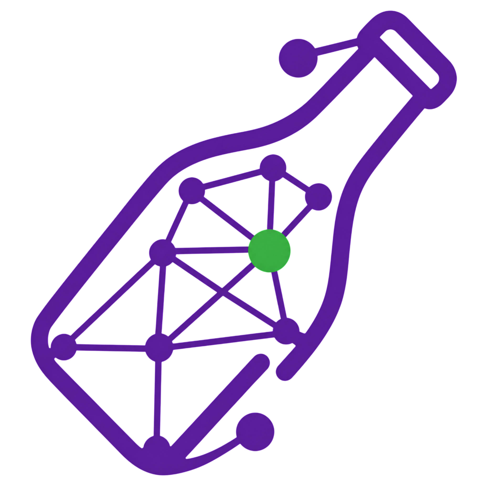

<div align="center">



# BottleLink

**Plataforma de monitorización de enlaces y archivos en la nube**

[](https://www.typescriptlang.org/)
[](https://react.dev/)
[](https://tailwindcss.com/)
[](https://vite.dev/)
[](https://www.sqlite.org/)
[](LICENSE)

</div>

---

BottleLink monitoriza automáticamente enlaces de servicios de almacenamiento en la nube, detecta cambios en archivos, registra el historial completo y muestra todo en un dashboard interactivo con tema oscuro.

## ✨ Características

- 🔗 **Monitorización periódica** de enlaces de múltiples proveedores cloud
- 🔍 **Detección de cambios** en archivos y metadatos (tamaño, codecs, resolución…)
- 📊 **Dashboard interactivo** con gráficos de distribución y disponibilidad
- 🎬 **Análisis multimedia** con FFmpeg — extrae duración, resolución, codecs
- 📜 **Historial completo** de verificaciones y eventos por enlace
- ⚙️ **Sin Redis ni Docker** — usa SQLite y cron nativo
- 🌙 **Tema oscuro** con diseño moderno y alto contraste

## 🌐 Proveedores soportados

| Proveedor | Tipo |
|---|---|
| MEGA | Almacenamiento cifrado |
| MediaFire | Compartir archivos |
| Google Drive | Suite de Google |
| Dropbox | Almacenamiento en la nube |
| OneDrive | Suite de Microsoft |
| Pixeldrain | Compartir archivos |
| HTTP / HTTPS | Cualquier enlace web genérico |

---

## 🚀 Inicio rápido

### Prerrequisitos

- **Node.js 18+**
- **FFmpeg** instalado y disponible en el PATH

```bash
# macOS
brew install ffmpeg

# Ubuntu / Debian
sudo apt install ffmpeg

# Windows — descargar desde https://ffmpeg.org/download.html
# y agregar la carpeta bin al PATH del sistema
```

### 1. Clonar e instalar

```bash
git clone <https://github.com/AcerosDavid/bottlelink.git>
cd bottlelink
npm install
```

### 2. Configurar variables de entorno

```bash
# Copiar la plantilla
cp .env.example .env
```

El archivo `.env` ya viene con valores por defecto listos para desarrollo:

```env
PORT=3001
NODE_ENV=development
DB_PATH=data/bottlelink.db
API_PREFIX=/api
PROVIDER_FETCH_TIMEOUT_MS=30000
VITE_API_BASE=/api
VITE_SERVER_PORT=3001
```
> Usa `.env.example` como referencia para otros desarrolladores.

### 3. Poblar con datos de ejemplo *(opcional)*

```bash
npm run seed
```

Esto inserta 10 enlaces de ejemplo con diferentes estados, metadatos de archivos, historial de verificaciones y eventos para que el dashboard se vea poblado desde el primer arranque.

### 4. Iniciar el proyecto

Necesitas **dos terminales** — una para el backend y otra para el frontend:

```bash
# Terminal 1 — Backend (API + workers)
npm run dev:server

# Terminal 2 — Frontend
npm run dev
```

| Servicio | URL |
|---|---|
| Frontend | http://localhost:5173 |
| API | http://localhost:3001/api |
| Health check | http://localhost:3001/api/health |

---

## 📋 Scripts disponibles

```bash
npm run dev          # Frontend en modo desarrollo (Vite HMR)
npm run dev:server   # Backend en modo desarrollo (nodemon + tsx)
npm run build        # Compilar frontend para producción
npm run preview      # Previsualizar el build de producción
npm run seed         # Insertar datos de ejemplo en la base de datos
npm run lint         # Ejecutar el linter (oxlint)
```

---

## 📡 API Endpoints

### Enlaces
```
GET    /api/links                  Listar todos los enlaces
POST   /api/links                  Crear nuevo enlace
GET    /api/links/:id              Detalles de un enlace
PUT    /api/links/:id              Actualizar enlace
DELETE /api/links/:id              Eliminar enlace
POST   /api/links/:id/check        Verificar enlace manualmente
GET    /api/links/:id/history      Historial de verificaciones
GET    /api/links/:id/events       Eventos del enlace
GET    /api/links/status/:status   Filtrar por estado
```

### Estadísticas
```
GET /api/statistics/overall                Estadísticas generales
GET /api/statistics/providers              Por proveedor
GET /api/statistics/links/:id             De un enlace específico
GET /api/statistics/activity               Actividad reciente
GET /api/statistics/distribution/status   Distribución por estado
GET /api/statistics/distribution/filetypes Por tipo de archivo
GET /api/statistics/timebased             Basadas en tiempo
```

### Proveedores
```
GET    /api/providers       Listar proveedores
POST   /api/providers       Crear proveedor
GET    /api/providers/:id   Detalles
PUT    /api/providers/:id   Actualizar
DELETE /api/providers/:id   Eliminar
```

### Health
```
GET /api/health   Estado del servidor
```

---

## 📁 Estructura del proyecto

```
bottlelink/
├── src/
│   ├── components/              # Componentes React
│   │   ├── Dashboard.tsx        # Vista principal con stats y tabla
│   │   ├── LinkDetails.tsx      # Detalle de enlace con historial
│   │   ├── AddLinkModal.tsx     # Modal para agregar enlace
│   │   └── StatisticsCharts.tsx # Gráficos con Recharts
│   ├── utils/
│   │   └── api.ts               # Cliente HTTP del frontend
│   ├── App.tsx                  # Componente raíz
│   ├── main.tsx                 # Punto de entrada React
│   └── server/
│       ├── controllers/         # Controladores de la API REST
│       ├── models/              # Acceso a la base de datos (SQLite)
│       ├── providers/           # Adaptadores por proveedor cloud
│       ├── services/            # Lógica de negocio
│       ├── jobs/                # Workers y cron jobs
│       ├── routes/              # Definición de rutas Express
│       ├── middleware/          # Error handler, not-found
│       ├── seed.ts              # Script de datos de ejemplo
│       └── index.ts             # Punto de entrada del servidor
├── data/                        # Base de datos SQLite (auto-creada)
├── public/                      # Archivos estáticos
├── .env                         # Variables de entorno (no commitear)
├── .env.example                 # Plantilla de variables de entorno
└── package.json
```

---

## 📈 Estados de los enlaces

| Estado | Descripción |
|---|---|
| `ACTIVE` | Enlace disponible y funcionando |
| `DEAD` | Enlace caído o eliminado (404) |
| `CHANGED` | El archivo cambió desde la última verificación |
| `RESTRICTED` | Requiere autenticación o permisos (403) |
| `REDIRECTED` | El enlace redirige a otra URL |
| `ERROR` | Error de conexión o timeout |
| `UNKNOWN` | Aún no se ha verificado |

---

## 🛠 Tecnologías

| Capa | Tecnología |
|---|---|
| Frontend | React 19 + TypeScript |
| Estilos | Tailwind CSS v4 + @tailwindcss/vite |
| Gráficos | Recharts |
| Bundler | Vite 8 |
| Backend | Express 5 + TypeScript |
| Base de datos | SQLite (better-sqlite3) |
| Scheduler | node-cron |
| Multimedia | fluent-ffmpeg |
| Runtime dev | tsx + nodemon |

---

## 🧩 Agregar un nuevo proveedor

1. Crea `src/server/providers/MiProviderProvider.ts` extendiendo `BaseProvider`
2. Implementa `validateUrl(url)` y `checkLink(url)`
3. Regístralo en `ProviderFactory.ts`
4. Agrégalo en la lista de proveedores por defecto en `database.ts`

---

## 📝 Licencia

MIT © BottleLink

---

<div align="center">
  Desarrollado con TypeScript, React y SQLite
</div>
